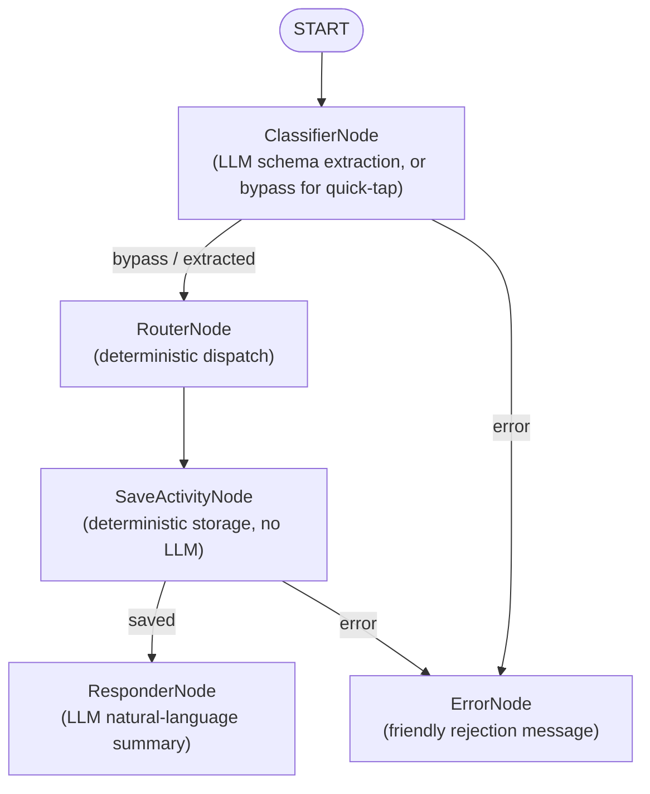

# nanny

Local baby activity tracker built on **Google ADK 2.0** (`google-adk`).

Combines a deterministic quick-tap dashboard with a natural-language chat
interface over one shared local datastore, orchestrated as a directed acyclic
graph of agents/nodes using `google.adk.workflow`.

## Agent graph



- **ClassifierNode** — passes pre-formatted quick-tap JSON straight through
  (no LLM), or extracts a structured record from chat text via Gemini
  (`google.genai`, constrained JSON schema output).
- **RouterNode** — deterministic bookkeeping; declares which branch produced
  the record.
- **SaveActivityNode** — 100% deterministic; appends to a local JSON-lines
  log (`data/activity_log.jsonl`).
- **ResponderNode** — crafts a one-sentence natural confirmation from the
  save transaction metadata.
- **ErrorNode** — terminal branch reached from either the classifier or the
  save step when the input can't be validated.

Every node reads/writes the real ADK session state (`ctx.state`), matching
the PRD's shared `BabyActivity` schema.

## Getting started

### Prerequisites

- Python >= 3.11
- [uv](https://docs.astral.sh/uv/) (manages the virtualenv and dependencies)

### Install

```sh
uv sync
```

This creates `.venv/` and installs runtime dependencies (`google-adk`,
`fastapi`, `uvicorn`) plus the dev group (`pytest`, `google-agents-cli`).

### Launch

```sh
uv run main.py
```

Then open **http://127.0.0.1:8000** in a browser. You'll see the dual-panel
UI: quick-tap buttons on the left, an AI chat log on the right. Both write to
the same running totals.

The server binds to `127.0.0.1:8000` by default; set `NANNY_PORT` to change
the port. Activity data is appended to `data/activity_log.jsonl` (created on
first write).

To stop the server, press `Ctrl+C` (or, if it was started in the background,
`pkill -f "python main.py"`).

### Verify it's working

```sh
curl -s -X POST http://127.0.0.1:8000/api/quick-tap \
  -H 'Content-Type: application/json' \
  -d '{"activity_type":"bottle","quantity":4,"unit":"oz","notes":""}'

curl -s -X POST http://127.0.0.1:8000/api/chat \
  -H 'Content-Type: application/json' \
  -d '{"text":"he pooped a lot at 3 PM"}'

curl -s http://127.0.0.1:8000/api/history
```

## LLM configuration

Set `GEMINI_API_KEY` (or `GOOGLE_API_KEY`) to have the ClassifierNode and
ResponderNode call Gemini for real. Without a key, both fall back to a small
offline heuristic so the app is still fully runnable — every response
reports `used_llm_extraction` / `used_llm_response` so you can tell which
path served a given request.

## Development

```sh
uv sync                 # install runtime + dev deps
uv run pytest           # run tests
uv run agents-cli lint  # ruff + codespell + ty, via the ADK CLI toolchain
```

Deployment, CI/CD, and cloud configs are explicitly out of scope for this
project.
